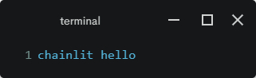
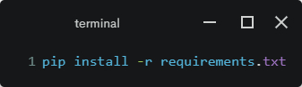
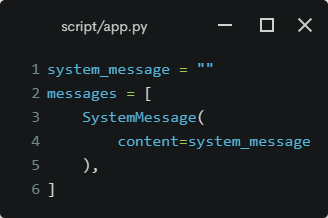
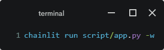

# ABOUT

This is a chatbot UI project using the `chainlit` python library

This project was developed on Windows Subsystem For Linux 2 ([WSL2](https://learn.microsoft.com/en-us/windows/wsl/install)). It's Linux!

Python version 3.10

## Test

To test installation:

## Getting Started

### Environment Setup

Make sure you have `python==3.10`, and has created a python environment for this project.

### Setting ENV VAR
Make a copy of `.env.example` and rename it `.env`. This is where all your secret key will go. 

`.env` is `.gitignore`d to prevent your from commiting your secret by mistake.

### Edit System Message

Go to `script/app.py`, edit `system_message`.

### Running the app

 -w indicates auto-reload whenever we make changes live in our application code.

## Reference

1. https://www.analyticsvidhya.com/blog/2023/07/creating-a-chatbot-with-falconai-langchain-and-chainlit/#h-what-is-chainlit
1. https://python.langchain.com/docs/modules/model_io/models/chat/integrations/openai
1. https://docs.chainlit.io/integrations/langchain

## TODO

Explore possibilities of 
- user giving feedback on whether the response is good or bad (need to define what is meant by bad, e.g., factual inaccuracies, did not answer the question.)
- users editing the AI response.
- users editing their own query.
- stopping the response generation.
